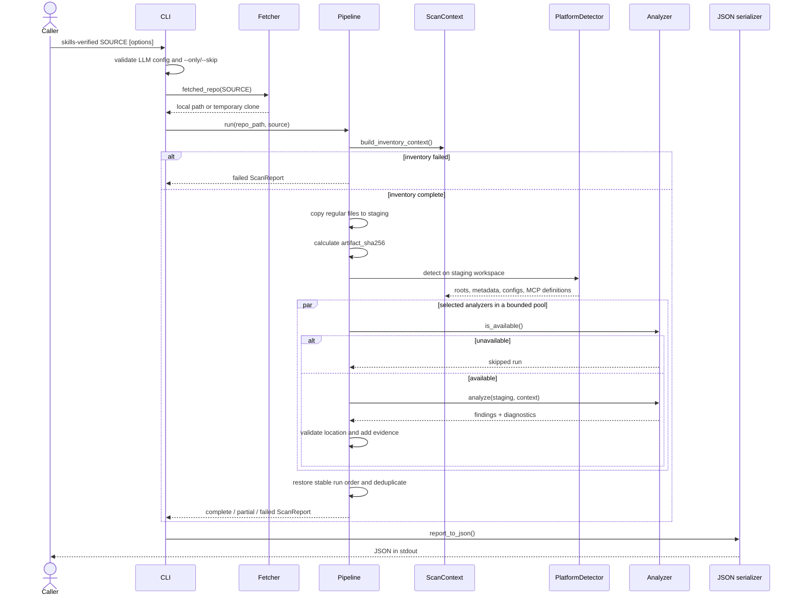
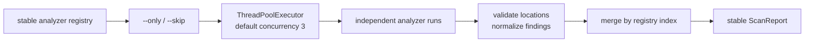
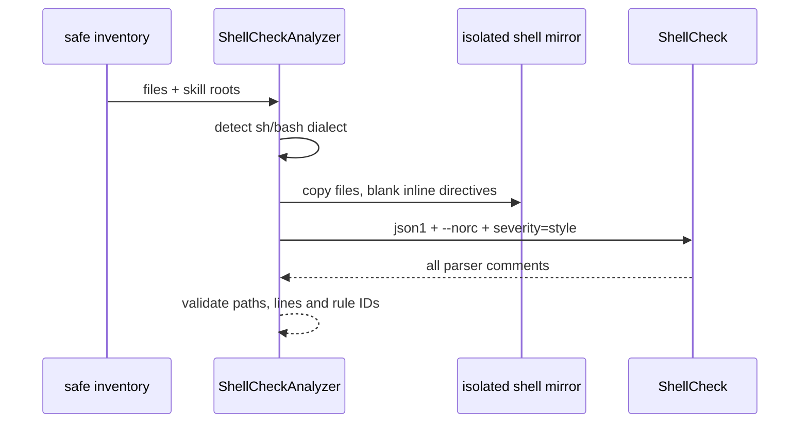
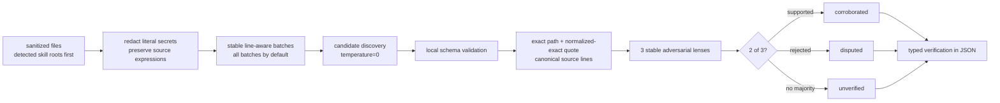
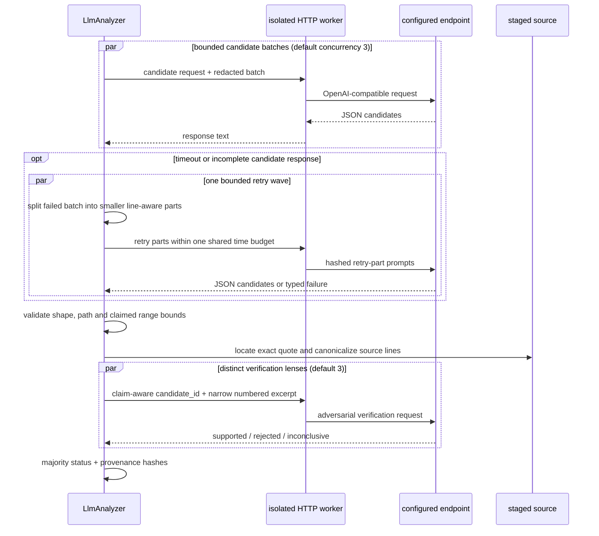
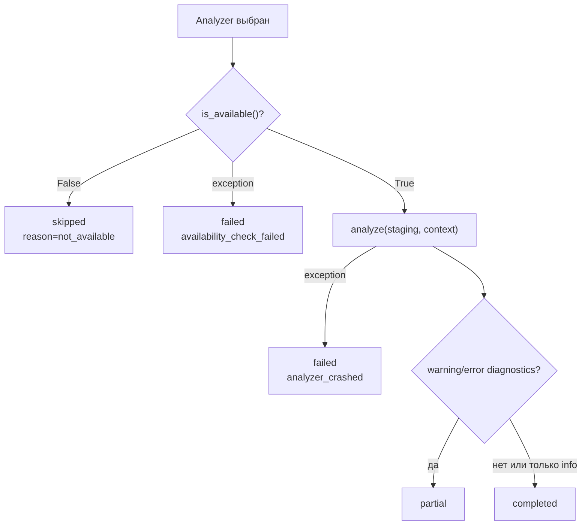
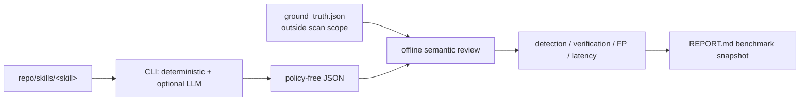

# Архитектура Skills Verified

## Назначение и границы

Skills Verified — статический анализатор недоверенных
репозиториев AI-agent skills. Его задача — собрать проверяемые факты и вернуть
versioned `ScanReport`. Решения `allow`, `deny`, `publish`, score и thresholds
находятся за пределами проекта.

Основной принцип:

```text
repository -> bounded acquisition -> safe inventory -> sanitized workspace
           -> platform context -> analyzers -> normalized findings -> JSON
```

Scanner не запускает scripts из репозитория и не вызывает package manager для
разрешения его зависимостей.

## Компоненты

| Путь | Ответственность |
|---|---|
| `src/skills_verified/cli.py` | Click CLI, выбор анализаторов, exit codes, JSON в stdout |
| `repo/fetcher.py` | Локальный source или ограниченный HTTPS/SSH clone |
| `repo/files.py` | Детерминированный inventory; internal symlink aliases сводятся к канонической цели, unsafe links и special files отклоняются |
| `core/context.py` | `ScanContext`, platform profiles, metadata, configs и MCP tools |
| `core/pipeline.py` | Staging, ограниченно-параллельный запуск, нормализация и итоговый status |
| `core/models.py` | `Finding`, `Diagnostic`, `AnalyzerRun`, `ScanReport` |
| `core/python_ast.py` | Парсинг недоверенного Python без утечки target `SyntaxWarning` в stderr |
| `platforms/` | Адаптеры Agent Skills, Claude, OpenClaw, Cursor, Codex, Gemini, Copilot и MCP |
| `analyzers/` | Независимые проверки, возвращающие findings и diagnostics |
| `analyzers/external_tool.py` | Поиск Bandit/Semgrep рядом с текущим Python, затем в `PATH` |
| `output/json_report.py` | Единственная JSON-модель для CLI и внешних сервисов |
| `data/*.yaml` | Версионируемые threat signatures, упакованные как package resources |

## Общий поток

```mermaid
flowchart LR
    Caller["CLI / CI / внешний сервис"] --> CLI["cli.py<br/>аргументы и выбор analyzers"]
    CLI --> Source{"SOURCE"}
    Source -->|"локальный каталог"| Local["resolve path"]
    Source -->|"HTTPS Git URL"| DNS["изолированный DNS worker"]
    DNS --> Clone["shallow clone<br/>IP pinning и limits"]
    Local --> Inventory["safe inventory"]
    Clone --> Inventory
    Inventory -->|"невозможно построить"| Failed["failed ScanReport"]
    Inventory --> Stage["sanitized temporary workspace<br/>artifact_sha256"]
    Stage --> Context["PlatformDetector + ScanContext"]
    Context --> Pool["bounded analyzer pool<br/>default concurrency 3"]
    Pool --> Normalize["location validation<br/>evidence + fingerprint"]
    Normalize --> Dedupe["deduplication"]
    Dedupe --> Report["policy-free ScanReport"]
    Report --> JSON["JSON stdout / --output"]
```



### Последовательность одного scan



Анализаторы получают один и тот же staged snapshot и `ScanContext`,
поэтому выполняются в `ThreadPoolExecutor` независимо. Максимум задаётся
`--analyzer-concurrency` (`3` по умолчанию, `1` для последовательного режима).
Результаты сначала собираются по индексу анализатора и только затем объединяются:
JSON и diagnostics не зависят от порядка завершения потоков. Внутренняя
параллельность LLM отдельно ограничена `--llm-concurrency`.

Progress callback сообщает старт и завершение каждого run, а LLM дополнительно
сообщает обработанные batches и retry. CLI сериализует эти события в `stderr`;
`stdout` зарезервирован только для итогового JSON.

## Получение и подготовка source

### Локальный каталог

`fetch_repo()` проверяет существование и тип пути, затем возвращает абсолютный
каталог. Pipeline всё равно считает его недоверенным и никогда не анализирует
файлы напрямую после построения inventory.

### Git URL

Публичный CLI разрешает только HTTPS. До clone выполняются:

1. синтаксическая проверка URL без credentials, query и fragment;
2. DNS resolution в отдельном `python -I` worker;
3. отклонение private, loopback, link-local и reserved addresses;
4. фиксация проверенных IP через Git `http.curloptResolve`;
5. shallow clone без tags, redirects, hooks и интерактивного ввода;
6. контроль общего deadline и оценочного места на диске.

CLI defaults — `120` секунд и `128 MiB`; они настраиваются через
`--clone-timeout`/`SV_CLONE_TIMEOUT` и
`--max-clone-mib`/`SV_MAX_CLONE_MIB`. Inventory budget отдельно задаётся через
`--max-scan-mib`/`SV_MAX_SCAN_MIB`.

Программный API может разрешить SSH через `allow_ssh=True`; по умолчанию он
выключен.

### Inventory и staging

`collect_safe_files()` сортирует обход для воспроизводимости, исключает `.git`,
virtualenv, caches и `node_modules`, не следует symlinks и пропускает special
files. Внутренняя symlink-цель уже покрывается по каноническому пути и отражается
info diagnostic; внешние, битые и исключённые цели деградируют scope. Лимиты
применяются к числу файлов, общему объёму и времени обхода; отдельного потолка на
один файл нет.

Затем `_sanitized_context()` повторно безопасно читает inventoried files и копирует
их в новый `TemporaryDirectory`. Все анализаторы видят только staging workspace.
Одновременно вычисляется `artifact_sha256` по относительным путям и содержимому
фактически скопированных файлов.

## Platform context

`PlatformDetector` запускает профили в порядке:

```text
Agent Skills -> Claude Code -> OpenClaw -> Cursor -> Codex -> Gemini
             -> Copilot -> Generic MCP
```

Подходящий профиль добавляет в `ScanContext`:

- `skill_roots`;
- нормализованные metadata (`name`, `description`, `author`, permissions);
- platform configs и rules files;
- MCP tool definitions;
- parse diagnostics и detection evidence.

Для Agent Skills значения `allowed-tools` переводятся в широкие capability
категории (`Read` -> `filesystem`, `Bash(...)` -> `shell`, `WebFetch` ->
`network`). `privilege` анализирует каждый skill только внутри его `skill_root`
или объявленных `entry_points`, поэтому код соседнего skill не создаёт mismatch.

Один репозиторий может соответствовать нескольким платформам. Metadata и configs
дедуплицируются до запуска анализаторов. Если ни один skill root не найден, scope
получает корень `.`.

Все file-oriented анализаторы получают один и тот же scope из безопасного inventory:
если skill roots найдены, соседний product code, тесты и служебные каталоги вне этих
roots не участвуют в findings. `config_injection`, `metadata`, `mcp` и `privilege`
дополнительно используют уже разобранные platform objects из `ScanContext`.
Python AST-анализаторы подавляют только parser `SyntaxWarning` чужого кода;
`SyntaxError` остаётся явным diagnostic и переводит соответствующий run в
`partial`.

## Реестр и параллельный запуск анализаторов

`_all_analyzers()` задаёт стабильный порядок runs в отчёте. `--only` и `--skip`
фильтруют этот реестр, после чего выбранные анализаторы отправляются в общий
bounded pool (до `3` рабочих потоков по умолчанию). Завершаться они могут в
любом порядке; Pipeline объединяет результаты по исходному индексу реестра.



| # | Analyzer | Что проверяет |
|---:|---|---|
| 1 | `pattern` | Опасные `eval/exec`, shell execution, небезопасную десериализацию, hardcoded secrets, download-and-execute; Python comments/docstrings не считаются исполнением |
| 2 | `cve` | Статически извлекает pinned PyPI/npm dependencies из requirements, `pyproject.toml`, Pipfile и `package-lock.json`, затем запрашивает OSV |
| 3 | `bandit` | Запускает внешний Bandit с confidence `medium+`; repository suppressions/configs не доверяются, capability-only advisories отбрасываются по rule ID |
| 4 | `shellcheck` | Парсит `sh`/`bash`, выявляет синтаксические и опасные semantic errors; repository suppressions и конфигурация игнорируются |
| 5 | `semgrep` | Проверяет SHA-256 зафиксированных `security-audit`/`python` rulesets, запускает локальные YAML только на skill roots и агрегирует parser gaps |
| 6 | `guardrails` | Prompt injection, role/safety override, extraction системного prompt и скрытые Unicode controls |
| 7 | `permissions` | Прямое использование удаления файлов, запуска процессов и сетевых API |
| 8 | `supply_chain` | Install hooks, исполняемый `setup.py` и package typosquatting |
| 9 | `llm` | Opt-in semantic review кода через OpenAI-compatible endpoint после redaction и полного line-aware batching |
| 10 | `obfuscation` | Hex/Base64/character-code payloads, decode-to-execute, mixed-script Python identifiers и сборку опасного имени для `getattr/setattr` |
| 11 | `reverse_shell` | Bash, netcat, PowerShell, socat и socket/subprocess reverse-shell signatures |
| 12 | `exfiltration` | Чтение credential-файлов с последующей отправкой, bulk environment harvesting и подтверждённый Python source-to-network/DNS flow |
| 13 | `behavioral` | Python AST source-to-sink flow и запись startup persistence hooks; для `subprocess` учитывается только исполняемая часть команды, включая статически фиксированный executable в command builders |
| 14 | `mcp` | Tool/schema poisoning, hidden Unicode, executable defaults, cross-tool chaining и dynamic tool-list/redefinition indicators |
| 15 | `config_injection` | Опасные hooks, API/MCP URL overrides, явные instruction-override фразы и credentials в platform configs |
| 16 | `metadata` | Явные instruction-override фразы в name/description и документации skill |
| 17 | `known_threats` | Известные malicious authors/namespaces, file hashes и campaign signatures |
| 18 | `privilege` | Сравнивает declared permissions с фактическим использованием, ищет over-privilege и опасные комбинации |

`pattern`, `permissions` и `privilege` намеренно пересекаются: первый ищет
конкретные опасные конструкции, второй сообщает capability, третий сопоставляет
capability с декларацией skill.

## Shell analysis

Общий detector распознаёт `.sh`, `.bash` и файлы без расширения с shebang
`sh`/`bash`. Это расширяет существующие pattern, LLM, exfiltration,
reverse-shell, obfuscation, known-threats и privilege проверки. Отдельный
`shellcheck` analyzer добавляет parser-level диагностику:



Analyzer не доверяет `.shellcheckrc`, `SHELLCHECK_OPTS` и inline disable. Он не
использует external-source mode и не исполняет scripts. `error` отображается как
`medium`, `warning` как `low`. Из `info` принимаются только `SC2029` и `SC2035`;
остальные `info/style` не входят в security report. `pattern` выполняет
дополнительные context-aware проверки для dynamic `eval`, caller-controlled
`source`, archive traversal и predictable temporary files.
Exit status `2`, timeout или ошибка отдельного batch создают diagnostic и статус
`partial`, если другие batches завершились, не скрывая их findings. Если не
завершился ни один batch, run получает статус `failed`.

## LLM discovery и проверка

LLM-анализатор включается только явно. Он не заменяет deterministic analyzers и
не скрывает их findings. При обнаруженных skills наружу уходят только файлы из
`skill_roots`, сначала `SKILL.md`, затем `scripts/`; без skill roots используется
весь inventory. Большие файлы делятся на стабильные сегменты с исходными номерами
строк; по умолчанию обрабатываются все batch. Явный budget отражается diagnostic,
поэтому ответы на первые batch не маскируют неполное покрытие. Его pipeline
фиксирован:

Candidate prompt требует русские человекочитаемые `title` и `description`, а
анализатор добавляет русскую `remediation`. Машинные enum, JSON-ключи, пути,
идентификаторы и exact evidence остаются без перевода; verification работает с
ними независимо от языка текста claim.





Split retry выполняется только для timeout или неполного candidate response и не
повторяется рекурсивно. Обе части делят budget одной попытки; ошибка любой части
оставляет LLM run в статусе `partial`, но не отменяет валидные результаты других
batches.

Привязка evidence не является byte-to-byte: нормализуются CRLF, пустые строки и
внешние отступы каждой строки. Внутри строки whitespace и остальные токены должны
точно совпасть с цитатой в заявленном файле; это не позволяет превратить
`shell=False` в `shell=True` или изменить строковый литерал через fuzzy matching.
Фактический диапазон вычисляется по найденной цитате и ограничен 20 строками.
Заявленные моделью строки используются только для выбора ближайшего exact-match;
равноудалённые совпадения отклоняются. Перепривязка сохраняет только path,
заявленные/фактические строки и evidence hash в `llm_evidence_rebound`. После
redaction evidence получает kind
`redacted_source`, потому что такая цитата относится к LLM input, а не напрямую к
artifact.

`candidate_id` хеширует нормализованные title, description, severity, path,
канонические start/end lines и evidence. Поэтому разные claims или severity на одной строке не
делят verifier decisions и не схлопываются последующим deduplication.

После общей нормализации Pipeline отмечает рядом с LLM finding идентификаторы
deterministic rules той же категории, если путь совпадает и перекрытие диапазонов
составляет не менее 80% объединённого диапазона (intersection over union). Это
только `co_located_deterministic_rule_ids`: поле сообщает близость location, а не
семантическое подтверждение; оно не меняет verification status и не является
publication verdict.

Для воспроизводимости сохраняются requested model, host endpoint,
`temperature=0`, лимиты, режим structured output, SHA-256 фактических
candidate/verification prompts и полных response envelopes. Выбранное имя
token-limit параметра (`max_tokens` или `max_completion_tokens`) также входит в
provenance; там же фиксируются опциональный `reasoning_effort` и лимит
параллельности. Candidate batches и verifier lenses выполняются волнами до этого
лимита (по умолчанию 3), а результаты собираются в стабильном порядке.
Provider-reported model, system fingerprint и `finish_reason` попадают в
diagnostics; ключи и полные ответы в отчёт не попадают. Каждый verification run
использует заранее заданный отдельный lens, поэтому requests не идентичны.
Повторный ответ внешней модели всё равно может отличаться, а вызовы одной модели
остаются коррелированными и не дают абсолютной гарантии.

Все кандидаты с корректно привязанным source evidence остаются findings, включая
`disputed` и `unverified`. Scanner не преобразует verification status в verdict;
это обязанность потребителя отчёта.

## Жизненный цикл analyzer run



Ошибка одного анализатора не останавливает остальные. Для каждого run сохраняются
`name`, `version`, `duration_ms`, `findings_count`, `status` и `reason`.

Итоговый `scan.status` вычисляется так:

- `failed` — inventory не построен или ни один analyzer не завершился хотя бы
  частично;
- `partial` — есть skipped/failed/partial run, degraded scope или error diagnostic;
- `complete` — все выбранные runs завершены и scope не деградировал.

Это состояние выполнения, а не verdict о безопасности.

## Нормализация findings

После каждого analyzer Pipeline:

1. проверяет, что location относится к staging inventory;
2. нормализует путь относительно корня;
3. добавляет source evidence, если analyzer его не предоставил;
4. вычисляет fingerprint из `rule_id`, location и evidence; LLM дополнительно
   включает claim-aware `candidate_id`;
5. дедуплицирует одинаковые fingerprints, оставляя большую confidence.

Для LLM finding Pipeline дополнительно сохраняет совпавшие deterministic rule IDs
по точному пути, категории и порогу перекрытия строк 80%.

Finding остаётся фактом с severity и confidence. Интерпретация этих полей,
allowlists, waivers, baselines и publication policy принадлежат потребителю.

## Внешние процессы и сеть

| Компонент | Внешнее взаимодействие | Изоляция |
|---|---|---|
| Fetcher | DNS и `git clone` | Отдельный DNS worker, neutral Git config, IP pinning, настраиваемые timeout и disk limit |
| CVE | `api.osv.dev` | Только package ecosystem/name/version, bounded responses и per-scan cache |
| Bandit | Локальный subprocess | Neutral cwd, trusted empty config, repository `# nosec` игнорируется, принимается confidence `medium+` |
| ShellCheck | Локальный subprocess | Отдельная копия shell-файлов, `--norc`, neutral environment, без external sources; inline suppressions удаляются с сохранением строк |
| Semgrep | Локальный subprocess | Встроенные rulesets ограничены по размеру и проверены по SHA-256, затем запускаются как local YAML в neutral cwd; сеть, repository suppressions и metrics выключены |
| LLM | Настроенный HTTP endpoint | `python -I` worker, secret redaction, no redirects, input/output/time limits |

Bandit и Semgrep разрешаются сначала как console scripts рядом с
`sys.executable`, затем через `PATH`. Это связывает subprocess с окружением CLI и
не позволяет случайной глобальной установке изменить выбранную версию.

Ни один из этих компонентов не должен исполнять код проверяемого репозитория.

## JSON report

`report_to_dict()` сериализует одну модель `ScanReport` со следующими секциями:

```text
schema_version
scan            -> status, timestamps, scanner/ruleset versions
source          -> input, commit_sha, artifact_sha256
scope           -> skill_roots, files/bytes scanned and skipped
platforms       -> detected profiles and evidence
analyzer_runs   -> полнота каждой проверки
findings        -> нормализованные проблемы
                   LLM findings также содержат verification + provenance hashes
summary         -> counts by severity, без score
diagnostics     -> ошибки, ограничения и причины partial/failed
```

Schema допускает будущие дополнительные поля, а `schema_version` фиксирует
breaking changes. CLI всегда печатает JSON в stdout для корректно начавшегося
scan; `--output` сохраняет дополнительную копию.

## Verification corpus

Blind corpus хранится в `tests/corpora/blind-60/`: сканируемые fixtures находятся
под `repo/skills/`, а `ground_truth.json` — за пределами передаваемого analyzer
пути. Поэтому ожидаемые уязвимости и labels не попадают ни в inventory, ни в LLM
prompt. Fixtures намеренно не форматируются и никогда не исполняются.



Сравнение не вводит score и не меняет JSON. Raw detection учитывает любой emitted
verification status; trusted-срез принимает только deterministic или
`corroborated`. Ложным считается фактически неверный security claim, а не
дополнительная истинная находка. Downstream-сервис сам выбирает публикационную
политику по findings, diagnostics и полноте runs.

## Расширение

Чтобы добавить analyzer:

1. унаследовать класс от `Analyzer`;
2. определить стабильное lowercase `name`;
3. реализовать `is_available()` и `analyze()`;
4. возвращать `Finding`, а неполноту описывать через `diagnostics`;
5. зарегистрировать factory в `_all_analyzers()` в требуемой позиции;
6. добавить focused test и contract assertions для location, evidence и run status.

Новый analyzer получает только sanitized workspace и уже построенный
`ScanContext`; отдельный plugin framework для этого не требуется.
